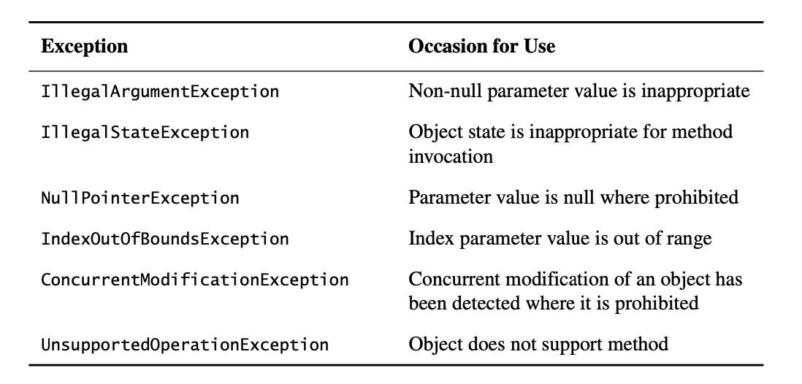

# Chapter 10: Exceptions

## Items 69: Use exceptions only for exceptional conditions
Exceptions are designed for exceptional conditions. Don't use them for ordinary control flow, and don't write APIs that force others to do so.

For example:
```java
for (Iterator<Foo> i = collection.iterator(); i.hasNext(); ) {
    Foo foo = i.next();
    ...
}
```

If Iterator lacked the hasNext method, clients would be forced to do this instead:
```java
// Do not use this hideous code for iteration over a collection!
try {
    Iterator<Foo> i = collection.iterator();
    while (true) {
        Foo foo = i.next();
        ...
    }
} catch (NoSuchElementException e) {
}
```

## Item 70: Use checked exceptions for recoverable conditions and runtime exceptions for programming errors
Throw checked exceptions for recoverable conditions and unchecked exceptions for programming errors. When in doubt, throw an unchecked exception. Don't define any throwables that are neither checked exceptions nor runtime exceptions. Provide methods on your checked exceptions to aid in recovery.

## Item 71: Avoid unnecessary use of checked exceptions
Turn a checked exception into an unchecked exception by breaking the method that throws the exception into two methods:

```java
//Invocation with checked exception
try {
    obj.action(args);
} catch (TheCheckedException e) {
    ... //Handle exceptional condition
}
```
```java
//Invocation with state-testing method and unchecked exception
if (obj.actionPermitted(args)) {
    obj.action(args);
} else {
    ... //Handle exceptional condition
}
```
The resulting API is essentially the state-testing method API in Item 69 and the same caveats apply: if an object is to be accessed concurrently without external synchronization or it is subject to externally induced state transitions, this refactoring is inappropriate because the object’s state may change between the calls to actionPermitted and action. If a separate actionPermitted method would duplicate the work of the action method, the refactoring may be ruled out on performance grounds.

## Item 72: Favor the use of standard exceptions



## Item 73: Throw exceptions appropriate to the abstraction
If the implementation of the higher layer changes in a later release, the exceptions it throws will change too, potentially breaking existing client programs.

To avoid this problem, higher layers should catch lower-level exceptions and, in their place, throw exceptions that can be explained in terms of the higher-level abstratction. This idiom is known as the *exception translation.

```java
// Exception translation
try {
    ... // Use lower-level abstraction to do our bidding
} catch (LowerLevelException e) {
    throw new HigherLevelException(...);
}
```

Real example in ```AbstractSequentialList```:
```java
/**
 * Returns the element at the specified position in this list.
 * @throws IndexOutOfBoundsException if the index is out of range
 *        ({@code index < 0 || index >= size()})
 */
public E get(int index) {
    ListIterator<E> i = listIterator(index);
    try {
        return i.next();
    } catch (NoSuchElementException e) {
        throw new IndexOutOfBoundsException("Index: "+index);
    }
}
```
A special form of exception translation called exception chaining is called for in cases where the lower-level exception might be helpful to someone debugging the problem that caused the higher-level exception. The lower-level exception (the cause) is passed to the higher-level exception, which provides an accessor method
(Throwable’s getCause method) to retrieve the lower-level exception:

```java
// Exception chaining
try {
    ... // Use lower-level abstraction to do our bidding
} catch (LowerLevelException cause) {
    throw new HigherLevelException(cause);
}
```

## Item 74: Document all exceptions thrown by each method

Always declare checked exceptions individually, and document precisely the conditions under which each one is thrown using the Javadoc @throws tag.

Use the Javadoc @throws tag to document each exception that a method can throw, but do not use the throws keyword on unchecked exceptions.

If an exception is thrown by many methods in a class for the same reason, you can document the exception in the class’s documentation comment rather than documenting it individually for each method.

## Item 75: Include failure-capture information in detail messages
To capture a failure, the detail message of an exception should contain the values of all parameters and fields that contributed to the exception.

One way to ensure that exceptions contain adequate failure-capture information in their detail messages is to require this information in their constructors instead of a string detail message. The detail message can then be generated automatically to include the information. For example, instead of a ```String``` constructor, ```IndexOutOfBoundsException``` could have had a constructor that looks like this:

```java
/**
 * Constructs an IndexOutOfBoundsException
 *
 * @param lowerBound the lowest legal index value
 * @param upperBound the highest legal index value plus one
 * @param index the actual index value
 */
public IndexOutOfBoundsException(int lowerBound, int upperBound, int index) {
    // Generate detail message that captures failure
    super(String.format("Lower bound: %d, Upper bound: %d, Index: %d", lowerBound, upperBound, index));

    // Save failure information for programmatic access
    this.lowerBound = lowerBound;
    this.upperBound = upperBound;
    this.index = index;
}
```

## Item 76: Strive for failure atomicity
Generally speaking, a failed method invocation should leave the object in the state that it was in prior to the invocation. A method with this property is said to be *failure-atomic*.

Several ways to achieve failure atomicity:
1. Check parameters for validity before performing the operation.

```java
public Object pop() {
    if (size == 0)
        throw new EmptyStackException();
    Object result = elements[--size];
    elements[size] = null; // Eliminate obsolete reference
    return result;
}
```

2. Order the computation so that any part that may fail takes place before any part that modifies the object. For example, consider the case of TreeMap, whose elements are sorted according to some ordering. In order to add an element to a TreeMap, the element must be of a type that can be compared using the TreeMap’s ordering. Attempting to add an incorrectly yped element will naturally fail with a ```ClassCastException``` as a result of searching for the element in the tree, before the tree has been modified in any way.

3. A third approach to achieving failure atomicity is to perform the operation on a temporary copy of the object and to replace the contents of the object with the temporary copy once the operation is complete.

4. A last and far less common approach to achieving failure atomicity is to write recovery code that intercepts a failure that occurs in the midst of an operation, and causes the object to roll back its state to the point before the operation began. This
approach is used mainly for durable (disk-based) data structures.

## Item 77: Don’t ignore exceptions
An empty catch block defeats the purpose of exceptions, which is to force you to handle exceptional conditions.

If you choose to ignore an exception, the catch block should contain a comment explaining why it is appropriate to do so, and the variable should be named ignored:

```java
Future<Integer> f = exec.submit(planarMap::chromaticNumber);
int numColors = 4; // Default to 4 if no answer comes in
try {
    numColors = f.get(1L, TimeUnit.SECONDS);
} catch (TimeoutException | ExecutionException ignored) {
    // Use default: minimal coloring is desirable, not required
}
```