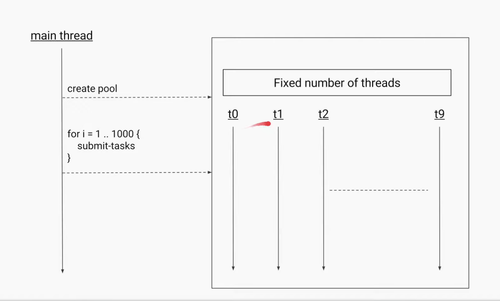
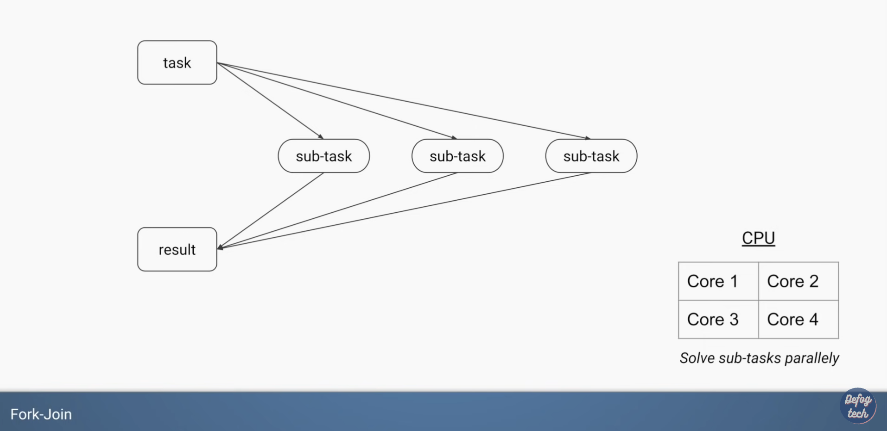
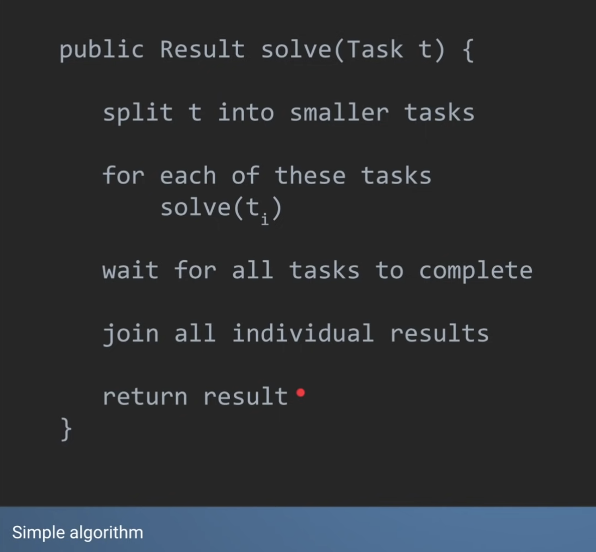

# Chapter 11: Concurrency

## Item 78: Synchronize access to shared mutable data
Reference for multithreading in Java
- [Multithreading in Java Explained in 10 Minutes](https://www.youtube.com/watch?v=r_MbozD32eo)
- [Multithreading Synchronized Keyword](https://www.youtube.com/watch?v=RH7G-N2pa8M)
- [What role has the VOLATILE keyword in Java?](https://www.youtube.com/watch?v=V2hC-g6FoGc)

Not only does synchronization prevent threads from observing an object in an inconsistent state, but it ensures that each thread entering a synchronized method or block sees the effects of all previous modifications that were guarded by the same lock. **Synchronization is required for reliable communication between threads as well as for mutual exclusion.**

```java
package effectivejava.chapter11.item78.fixedstopthread1;
import java.util.concurrent.*;

// Properly synchronized cooperative thread termination
public class StopThread {
    private static boolean stopRequested;

    private static synchronized void requestStop() {
        stopRequested = true;
    }

    private static synchronized boolean stopRequested() {
        return stopRequested;  // It would be atomic even without synchronization. It is used solely for its communication effects, not for mutual exclusion.
    }

    public static void main(String[] args)
            throws InterruptedException {
        Thread backgroundThread = new Thread(() -> {
            int i = 0;
            while (!stopRequested())
                i++;
        });
        backgroundThread.start();

        TimeUnit.SECONDS.sleep(1);
        requestStop();
    }
} 
```

While the ```volatile``` modifier performs no mutual exclusion, it guarantees that any thread that reads the field will see most recently written value (read and write will be done in main memory directly instead of through cache):

```java
package effectivejava.chapter11.item78.fixedstopthread2;
import java.util.concurrent.*;

// Cooperative thread termination with a volatile field
public class StopThread {
    private static volatile boolean stopRequested;

    public static void main(String[] args)
            throws InterruptedException {
        Thread backgroundThread = new Thread(() -> {
            int i = 0;
            while (!stopRequested)
                i++;
        });
        backgroundThread.start();

        TimeUnit.SECONDS.sleep(1);
        stopRequested = true;
    }
}
```
But still, for non-atomic operations such as ++, ```volatile``` does not work.

```java
// Broken - requires synchronization!
private static volatile int nextSerialNumber = 0;

public static int generateSerialNumber() {
    return nextSerialNumber++; // Not thread-safe
}
```


Follow the advice in Item 59 and use the class ```AtomicLong,``` which is part of ```java.util.concurrent.atomic```. This package provides primitives for lock-free, thread-safe programming on single variables. While volatile provides only the communication effects of synchronization, this package also provides atomicity. This is exactly what we want for g```enerateSerialNumber```, and it is likely to outperform the synchronized version:

```java
// Lock-free synchronization with java.util.concurrent.atomic
private static final AtomicLong nextSerialNum = new AtomicLong();

public static long generateSerialNumber() {
    return nextSerialNum.getAndIncrement();
}
```

## Item 79: Avoid excessive synchronization
Inside a synchronized region, do not invoke a method that is designed to be overriden, or one provided by a client in the form of a function object. From the perspective of the class with the synchronized region, such methods are *alien*.

```java
package effectivejava.chapter11.item79;
import java.util.*;
import java.util.concurrent.CopyOnWriteArrayList;

// Broken - invokes alien method from synchronized block!
public class ObservableSet<E> extends ForwardingSet<E> {
    public ObservableSet(Set<E> set) { super(set); }

//    private final List<SetObserver<E>> observers
//            = new ArrayList<>();

//    public void addObserver(SetObserver<E> observer) {
//        synchronized(observers) {
//            observers.add(observer);
//        }
//    }
//
//    public boolean removeObserver(SetObserver<E> observer) {
//        synchronized(observers) {
//            return observers.remove(observer);
//        }
//    }

//    private void notifyElementAdded(E element) {
//        synchronized(observers) {
//            for (SetObserver<E> observer : observers)
//                observer.added(this, element);
//        }
//    }

//    // Alien method moved outside of synchronized block - open calls
//    private void notifyElementAdded(E element) {
//        List<SetObserver<E>> snapshot = null;
//        synchronized(observers) {
//            snapshot = new ArrayList<>(observers);
//        }
//        for (SetObserver<E> observer : snapshot)
//            observer.added(this, element);
//    }

    // Thread-safe observable set with CopyOnWriteArrayList
    private final List<SetObserver<E>> observers =
            new CopyOnWriteArrayList<>();

    public void addObserver(SetObserver<E> observer) {
        observers.add(observer);
    }

    public boolean removeObserver(SetObserver<E> observer) {
        return observers.remove(observer);
    }

    private void notifyElementAdded(E element) {
        for (SetObserver<E> observer : observers)
            observer.added(this, element);
    }

    @Override public boolean add(E element) {
        boolean added = super.add(element);
        if (added)
            notifyElementAdded(element);
        return added;
    }

    @Override public boolean addAll(Collection<? extends E> c) {
        boolean result = false;
        for (E element : c)
            result |= add(element);  // Calls notifyElementAdded
        return result;
    }
}
```

## Item 80: Prefer executors, tasks, and streams to threads
References:
- [Java ExecutorService - Part 1 - Introduction](https://www.youtube.com/watch?v=6Oo-9Can3H8)
- [Understanding how ForkJoinPool works](https://www.youtube.com/watch?v=5wgZYyvIVJk)

### Fixed Thread Pool


```java
public static void main(String[] args) {
    ExecutorService service = Executors.newFixedThreadPool(10);
    for (int i = 0; i < 100; i++) {
        service.execute(new Task());
    }
    System.out.println("Thread Name: " + Thread.currentThread().getName());
    service.shutdown();
}

static class Task implements Runnable {
    @Override
    public void run() {
        System.out.println("Thread Name: " + Thread.currentThread().getName());
    }
}
```
### Fork Join Pool


Stealing subtask from other thread if the tread is idle.


## Item 81: Prefer concurrency utilities to wait and notify

This framework consists of a single method that takes an executor to execute the action, a concurrency level representing the number of actions to be executed concurrently, and a runnable representing the action. All of the worker threads ready themselves to run the action before the timer thread starts the clock. When the last worker thread is ready to run the action, the timer thread “fires the starting gun,” allowing the worker threads to perform the action. As soon as the last worker thread finishes performing the action, the timer thread stops the clock. Implementing this logic directly on top of wait and notify would be messy to say the least, but it is surprisingly straightforward on top of ```CountDownLatch```:

```java
package effectivejava.chapter11.item81;
import java.util.concurrent.*;

// Simple framework for timing concurrent execution 327
public class ConcurrentTimer {
    private ConcurrentTimer() { } // Noninstantiable

    public static long time(Executor executor, int concurrency,
                            Runnable action) throws InterruptedException {
        CountDownLatch ready = new CountDownLatch(concurrency);
        CountDownLatch start = new CountDownLatch(1);
        CountDownLatch done  = new CountDownLatch(concurrency);

        for (int i = 0; i < concurrency; i++) {
            executor.execute(() -> {
                ready.countDown(); // Tell timer we're ready
                try {
                    start.await(); // Wait till peers are ready
                    action.run();
                } catch (InterruptedException e) {
                    Thread.currentThread().interrupt();
                } finally {
                    done.countDown();  // Tell timer we're done
                }
            });
        }

        ready.await();     // Wait for all workers to be ready
        long startNanos = System.nanoTime();
        start.countDown(); // And they're off!
        done.await();      // Wait for all workers to finish
        return System.nanoTime() - startNanos;
    }
}
```
```java
// The standard idiom for using the wait method
synchronized (obj) {
    while (<condition does not hold>)
        obj.wait();
    ... // Perform action appropriate to condition
}
```
Always use the wait loop idiom to invoke the ```wait``` method; never invoke it outside the loop. The ```notifyAll``` method should generally be used in preference to ```notify```. If ```notify``` is ussed, great care must be taken to ensure liveness.

## Item 82: Document thread safety
The following list summarizes levels of thread safety. It is not exhaustive but covers the common cases:

- Immutable: Instances of this class appear constant No external synchronization is necessary. Examples include ```String```, ```Long```, and ```BigInteger``` (Item 17).
- Unconditionally thread-safe: Instances of this class are mutable, but the class has sufficient internal synchronization that its instances can be used concurrently without the need for any external synchronization. Examples include ```AtomicLong``` and ```ConcurrentHashMap```.
- Conditionally thread-safe: Like unconditionally thread-safe, except that some methods require external synchronization for safe concurrent use. Examples include the collections returned by the ```Collections.synchronized``` wrappers, whose iterators require external synchronization.
- Not thread-safe: Instances of this class are mutable.To use them concurrently, clients must surround each method invocation (or invocation sequence) with external synchronization of the clients’ choosing. Examples include the general-purpose collection implementations, such as ```ArrayList``` and ```HashMap```.
- Thread-hostile: This class is unsafe for concurrent use even if every method invocation is surrounded by external synchronization. Thread hostility usually results from modifying static data without synchronization. No one writes a thread-hostile class on purpose; such classes typically result from the failure to consider concurrency. When a class or method is found to be thread-hostile, it is typically fixed or deprecated. The ```generateSerialNumber``` method in Item 78 would be thread-hostile in the absence of internal synchronization, as discussed on page 322.

```java
// Private lock object idiom - thwarts denial-of-service attack
private final Object lock = new Object();

public void foo() {
    synchronized (lock) {
    }
}
```

The private lock object idiom can be used only on unconditionally thread-safe classess. It is also well-suited to classses deisigned for inheritence. If such a class were to use its instances for locking, a subclass could easily and unintentionally interfere with the operation of the base class, or vice versa.

## Item 83: Use lazy initialization judiciously
Lazy initialization is a double-edged sword. It decreases the cost of initializing a class or creating an instance, at the expense of increasing the cost of accessing the lazily initialized field.

For static fieldss, use the lazy initialization holder class idiom.

```java
// Lazy initialization holder class idiom for static fields
private static class FieldHolder {
    static final FieldType field = computeFieldValue();
}

private static FieldType getField() { return FieldHolder.field; }
```

For instance fields, use the double-check idiom.

```java
// Double-check idiom for lazy initialization of instance fields
private volatile FieldType field;

private FieldType getField() {
    FieldType result = field;
    if (result == null) { // First check (no locking)
        synchronized(this) {
            if (field == null) // Second check (with locking)
                field = result = computeFieldValue();
        }
    }
    return result;
}
```

For instance fields that can tolerate repeated initialization, use the single-check idiom.

```java
// Single-check idiom - can cause repeated initialization!
private volatile FieldType field;

private FieldType getField() {
    FieldType result = field;
    if (result == null)
        field = result = computeFieldValue();
    return result;
}
```

## Item 84: Don’t depend on the thread scheduler
The average number of runnable threads should not be significantly greater than the number of processors.

Threads should not run if they aren't doing useful work and no busy-wait (i.e. repeatedly checking a shared object waiting for its state to change.)

```java
package effectivejava.chapter11.item84;

// Awful CountDownLatch implementation - busy-waits incessantly!  - Pages 336-7
public class SlowCountDownLatch {
    private int count;

    public SlowCountDownLatch(int count) {
        if (count < 0)
            throw new IllegalArgumentException(count + " < 0");
        this.count = count;
    }

    public void await() {
        while (true) {
            synchronized(this) {
                if (count == 0)
                    return;
            }
        }
    }
    public synchronized void countDown() {
        if (count != 0)
            count--;
    }
}
```