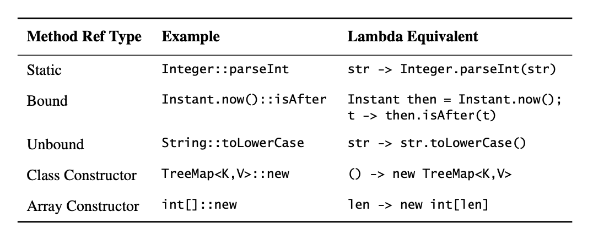

# Chapter 7: Lambdas and Streams
## Item 42: Prefer lambdas to anonymous classes

The verbosity of anonymous classes made functional programming in Java an unappealing prospect.
```java
package effectivejava.chapter7.item42;

import java.util.Arrays;
import java.util.Collections;
import java.util.Comparator;
import java.util.List;
import static java.util.Comparator.*;

import static java.util.Comparator.comparingInt;

// Sorting with function objects (Pages 193-4)
public class SortFourWays {
    public static void main(String[] args) {
        List<String> words = Arrays.asList(args);

        // Anonymous class instance as a function object - obsolete! (Page 193)
        Collections.sort(words, new Comparator<String>() {
            public int compare(String s1, String s2) {
                return Integer.compare(s1.length(), s2.length());
            }
        });
        System.out.println(words);
        Collections.shuffle(words);

        // Lambda expression as function object (replaces anonymous class) (Page 194)
        Collections.sort(words,
                (s1, s2) -> Integer.compare(s1.length(), s2.length()));
        System.out.println(words);
        Collections.shuffle(words);

        // Comparator construction method (with method reference) in place of lambda (Page 194)
        Collections.sort(words, comparingInt(String::length));
        System.out.println(words);
        Collections.shuffle(words);

        // Default method List.sort in conjunction with comparator construction method (Page 194)
        words.sort(comparingInt(String::length));
        System.out.println(words);
    }
}
```
```java
package effectivejava.chapter7.item42;

import java.util.function.DoubleBinaryOperator;

// Enum with function object fields & constant-specific behavior (Page 195)
public enum Operation {
    PLUS  ("+", (x, y) -> x + y),
    MINUS ("-", (x, y) -> x - y),
    TIMES ("*", (x, y) -> x * y),
    DIVIDE("/", (x, y) -> x / y);

    private final String symbol;
    private final DoubleBinaryOperator op;

    Operation(String symbol, DoubleBinaryOperator op) {
        this.symbol = symbol;
        this.op = op;
    }

    @Override public String toString() { return symbol; }

    public double apply(double x, double y) {
        return op.applyAsDouble(x, y);
    }

    // Main method from Item 34 (Page 163)
    public static void main(String[] args) {
        double x = Double.parseDouble(args[0]);
        double y = Double.parseDouble(args[1]);
        for (Operation op : Operation.values())
            System.out.printf("%f %s %f = %f%n",
                    x, op, y, op.apply(x, y));
    }
}
```
Lambdas share with anonymous classes the property that you can't reliably seriablize and deserialize them across implementations.

## Item 43: Prefer method references to lambdas
```java
package effectivejava.chapter7.item43;

import java.util.Map;
import java.util.TreeMap;

// Frequency table implemented with map.merge, using lambda and method reference (Page 197)
public class Freq {
    public static void main(String[] args) {
        Map<String, Integer> frequencyTable = new TreeMap<>();
        
        for (String s : args)
            frequencyTable.merge(s, 1, (count, incr) -> count + incr); // Lambda
        System.out.println(frequencyTable);

        frequencyTable.clear();
        for (String s : args)
            frequencyTable.merge(s, 1, Integer::sum); // Method reference
        System.out.println(frequencyTable);

    }
}
```
Many method references refer to static methods, but there are four kinds that do not. Two of them are **bound and unbound** instance method references. In bound references, the receiving object is specified in the method reference. Bound references are similar in nature to static references: the function object takes the same arguments as the referenced method. In unbound references, the receiving object is specified when the function object is applied, via an additional parameter before the method’s declared parameters. Unbound references are often used as mapping and filter functions in stream pipelines (Item 45). Finally, there are two kinds of constructor references, for classes and arrays. Constructor references serve as factory objects. All five kinds of method references are summarized in the table below:



## Item 44: Favor the use of standard functional interfaces
Now that Java has lambdas, best practices for writing APIs have changed consid- erably. For example, the Template Method pattern， wherein a subclass overrides a primitive method to specialize the behavior of its superclass, is far less attractive. The modern alternative is to provide a static factory or constructor that accepts a function object to achieve the same effect. More generally, you’ll be writing more constructors and methods that take function objects as parameters. Choosing the right functional parameter type demands care.

```java
 protected boolean removeEldestEntry(Map.Entry<K,V> eldest) {
      return size() > 100;
}

//should be change to:
// Unnecessary functional interface; use a standard one instead.
   @FunctionalInterface interface EldestEntryRemovalFunction<K,V>{
       boolean remove(Map<K,V> map, Map.Entry<K,V> eldest);
}
```

The basic interfaces operate on object reference types. The Operator interfaces represent functions whose result and argument types are the same. The Predicate interface represents a function that takes an argument and returns a boolean. The Function interface represents a function whose argument and return types differ. The Supplier interface represents a function that takes no arguments and returns (or “supplies”) a value. Finally, Consumer represents a function that takes an argument and returns nothing, essentially consuming its argument. The six basic functional interfaces are summarized below:


