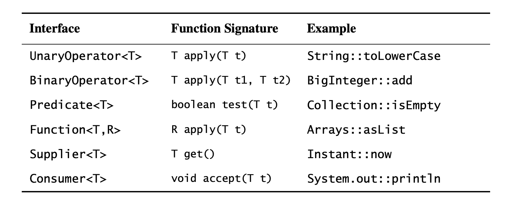

# Chapter 7: Lambdas and Streams
## Item 42: Prefer lambdas to anonymous classes

The verbosity of anonymous classes made functional programming in Java an unappealing prospect.
```java
package effectivejava.chapter7.item42;

import java.util.Arrays;
import java.util.Collections;
import java.util.Comparator;
import java.util.List;
import static java.util.Comparator.*;

import static java.util.Comparator.comparingInt;

// Sorting with function objects (Pages 193-4)
public class SortFourWays {
    public static void main(String[] args) {
        List<String> words = Arrays.asList(args);

        // Anonymous class instance as a function object - obsolete! (Page 193)
        Collections.sort(words, new Comparator<String>() {
            public int compare(String s1, String s2) {
                return Integer.compare(s1.length(), s2.length());
            }
        });
        System.out.println(words);
        Collections.shuffle(words);

        // Lambda expression as function object (replaces anonymous class) (Page 194)
        Collections.sort(words,
                (s1, s2) -> Integer.compare(s1.length(), s2.length()));
        System.out.println(words);
        Collections.shuffle(words);

        // Comparator construction method (with method reference) in place of lambda (Page 194)
        Collections.sort(words, comparingInt(String::length));
        System.out.println(words);
        Collections.shuffle(words);

        // Default method List.sort in conjunction with comparator construction method (Page 194)
        words.sort(comparingInt(String::length));
        System.out.println(words);
    }
}
```
```java
package effectivejava.chapter7.item42;

import java.util.function.DoubleBinaryOperator;

// Enum with function object fields & constant-specific behavior (Page 195)
public enum Operation {
    PLUS  ("+", (x, y) -> x + y),
    MINUS ("-", (x, y) -> x - y),
    TIMES ("*", (x, y) -> x * y),
    DIVIDE("/", (x, y) -> x / y);

    private final String symbol;
    private final DoubleBinaryOperator op;

    Operation(String symbol, DoubleBinaryOperator op) {
        this.symbol = symbol;
        this.op = op;
    }

    @Override public String toString() { return symbol; }

    public double apply(double x, double y) {
        return op.applyAsDouble(x, y);
    }

    // Main method from Item 34 (Page 163)
    public static void main(String[] args) {
        double x = Double.parseDouble(args[0]);
        double y = Double.parseDouble(args[1]);
        for (Operation op : Operation.values())
            System.out.printf("%f %s %f = %f%n",
                    x, op, y, op.apply(x, y));
    }
}
```
Lambdas share with anonymous classes the property that you can't reliably seriablize and deserialize them across implementations.

## Item 43: Prefer method references to lambdas
```java
package effectivejava.chapter7.item43;

import java.util.Map;
import java.util.TreeMap;

// Frequency table implemented with map.merge, using lambda and method reference (Page 197)
public class Freq {
    public static void main(String[] args) {
        Map<String, Integer> frequencyTable = new TreeMap<>();
        
        for (String s : args)
            frequencyTable.merge(s, 1, (count, incr) -> count + incr); // Lambda
        System.out.println(frequencyTable);

        frequencyTable.clear();
        for (String s : args)
            frequencyTable.merge(s, 1, Integer::sum); // Method reference
        System.out.println(frequencyTable);

    }
}
```
Many method references refer to static methods, but there are four kinds that do not. Two of them are **bound and unbound** instance method references. In bound references, the receiving object is specified in the method reference. Bound references are similar in nature to static references: the function object takes the same arguments as the referenced method. In unbound references, the receiving object is specified when the function object is applied, via an additional parameter before the method’s declared parameters. Unbound references are often used as mapping and filter functions in stream pipelines (Item 45). Finally, there are two kinds of constructor references, for classes and arrays. Constructor references serve as factory objects. All five kinds of method references are summarized in the table below:


## Item 44: Favor the use of standard functional interfaces
Now that Java has lambdas, best practices for writing APIs have changed consid- erably. For example, the Template Method pattern， wherein a subclass overrides a primitive method to specialize the behavior of its superclass, is far less attractive. The modern alternative is to provide a static factory or constructor that accepts a function object to achieve the same effect. More generally, you’ll be writing more constructors and methods that take function objects as parameters. Choosing the right functional parameter type demands care.

```java
 protected boolean removeEldestEntry(Map.Entry<K,V> eldest) {
      return size() > 100;
}

//should be change to:
// Unnecessary functional interface; use a standard one instead.
   @FunctionalInterface interface EldestEntryRemovalFunction<K,V>{
       boolean remove(Map<K,V> map, Map.Entry<K,V> eldest);
}
```

The basic interfaces operate on object reference types. The Operator interfaces represent functions whose result and argument types are the same. The Predicate interface represents a function that takes an argument and returns a boolean. The Function interface represents a function whose argument and return types differ. The Supplier interface represents a function that takes no arguments and returns (or “supplies”) a value. Finally, Consumer represents a function that takes an argument and returns nothing, essentially consuming its argument. The six basic functional interfaces are summarized below:



## Item 45: Use streams judiciously
Stream pipelines are evaluated lazily: evaluation doesn't start until the terminal operation is invoked, and data elements that aren't required in order to complete the terminal operation are never computed.

```java
package effectivejava.chapter7.item45.anagrams;

import java.io.IOException;
import java.nio.file.Files;
import java.nio.file.Path;
import java.nio.file.Paths;
import java.util.Arrays;
import java.util.stream.Stream;

import static java.util.stream.Collectors.groupingBy;

// Tasteful use of streams enhances clarity and conciseness (Page 205)
public class HybridAnagrams {
    public static void main(String[] args) throws IOException {
        Path dictionary = Paths.get(args[0]);
        int minGroupSize = Integer.parseInt(args[1]);

        try (Stream<String> words = Files.lines(dictionary)) {
            words.collect(groupingBy(word -> alphabetize(word)))
                    .values().stream()
                    .filter(group -> group.size() >= minGroupSize)
                    .forEach(g -> System.out.println(g.size() + ": " + g));
        }
    }

    private static String alphabetize(String s) {
        char[] a = s.toCharArray();
        Arrays.sort(a);
        return new String(a);
    }
}
```
You should refran from using streams to process char values because they are treated as integers rather than characters.

```java
package effectivejava.chapter7.item45;

import java.math.BigInteger;
import java.util.stream.Stream;

import static java.math.BigInteger.*;

// Generating the first twent Mersenne primes using streams (Page 208)
public class MersennePrimes {
    static Stream<BigInteger> primes() {
        return Stream.iterate(TWO, BigInteger::nextProbablePrime);
    }

    public static void main(String[] args) {
        primes().map(p -> TWO.pow(p.intValueExact()).subtract(ONE))
                .filter(mersenne -> mersenne.isProbablePrime(50))
                .limit(20)
                .forEach(mp -> System.out.println(mp.bitLength() + ": " + mp));
    }
}
```
Cartesian product of two sets
```java
package effectivejava.chapter7.item45;

import java.util.ArrayList;
import java.util.List;
import java.util.stream.Stream;
import static java.util.stream.Collectors.*;

// Generating the Cartesian product of two lists using iteration and streams (Page 209)
public class Card {
    public enum Suit { SPADE, HEART, DIAMOND, CLUB }
    public enum Rank { ACE, DEUCE, THREE, FOUR, FIVE, SIX, SEVEN,
                       EIGHT, NINE, TEN, JACK, QUEEN, KING }

    private final Suit suit;
    private final Rank rank;

    @Override public String toString() {
        return rank + " of " + suit + "S";
    }

    public Card(Suit suit, Rank rank) {
        this.suit = suit;
        this.rank = rank;

    }
    private static final List<Card> NEW_DECK = newDeck();

    // Iterative Cartesian product computation
//    private static List<Card> newDeck() {
//        List<Card> result = new ArrayList<>();
//        for (Suit suit : Suit.values())
//            for (Rank rank : Rank.values())
//                result.add(new Card(suit, rank));
//        return result;
//    }

    // Stream-based Cartesian product computation
    private static List<Card> newDeck() {
        return Stream.of(Suit.values())
                .flatMap(suit ->
                        Stream.of(Rank.values())
                                .map(rank -> new Card(suit, rank)))
                .collect(toList());
    }

    public static void main(String[] args) {
        System.out.println(NEW_DECK);
    }
}
```

## Item 46: Prefer side-effect-free functions in streams
```java
package effectivejava.chapter7.item46;

import java.io.File;
import java.io.FileNotFoundException;
import java.util.*;
import java.util.stream.Stream;

import static java.util.Comparator.comparing;
import static java.util.stream.Collectors.*;

// Frequency table examples showing improper and proper use of stream (Page 210-11)
public class Freq {
    public static void main(String[] args) throws FileNotFoundException {
        File file = new File(args[0]);

//        // Uses the streams API but not the paradigm--Don't do this!
//        Map<String, Long> freq = new HashMap<>();
//        try (Stream<String> words = new Scanner(file).tokens()) {
//            words.forEach(word -> {
//                freq.merge(word.toLowerCase(), 1L, Long::sum);
//            });
//        }

        // Proper use of streams to initialize a frequency table (
        Map<String, Long> freq;
        try (Stream<String> words = new Scanner(file).tokens()) {
            freq = words
                    .collect(groupingBy(String::toLowerCase, counting()));
        }

        System.out.println(freq);

        // Pipeline to get a top-ten list of words from a frequency table
        List<String> topTen = freq.keySet().stream()
                .sorted(comparing(freq::get).reversed())
                .limit(10)
                .collect(toList());

        System.out.println(topTen);
    }
}
```

## Item 47: Prefer Collection to Stream as a return type
If an API returns only a stream and some users want to iterate over the returned sequence with a for-each loop, those users will be justifiably upset. It is especially frustrating because the Stream interface contains the sole abstract method in the Iterable interface, and Stream’s specification for this method is compatible with Iterable’s. The only thing preventing programmers from using a for-each loop to iterate over a stream is Stream’s failure to extend Iterable.

workaround:
```java
package effectivejava.chapter7.item47;

import java.util.stream.Stream;
import java.util.stream.StreamSupport;

// Adapters from stream to iterable and vice-versa (Page 216)
public class Adapters {
    // Adapter from  Stream<E> to Iterable<E> (
    public static <E> Iterable<E> iterableOf(Stream<E> stream) {
        return stream::iterator;
    }

    // Adapter from Iterable<E> to Stream<E>
    public static <E> Stream<E> streamOf(Iterable<E> iterable) {
        return StreamSupport.stream(iterable.spliterator(), false);
    }
}
```

The Collection interface is a subtype of Iterable and has a stream method, so it provides for both iteration and stream access. But do not store a large sequence in memory just to return it as a collection.

### Power set (use AbstractList to save memory)
```java
package effectivejava.chapter7.item47;

import java.util.*;

public class PowerSet {
    // Returns the power set of an input set as custom collection (Page 218)
    public static final <E> Collection<Set<E>> of(Set<E> s) {
        List<E> src = new ArrayList<>(s);
        if (src.size() > 30)
            throw new IllegalArgumentException("Set too big " + s);
        return new AbstractList<Set<E>>() {
            @Override public int size() {
                return 1 << src.size(); // 2 to the power srcSize
            }

            @Override public boolean contains(Object o) {
                return o instanceof Set && src.containsAll((Set)o);
            }

            @Override public Set<E> get(int index) {
                Set<E> result = new HashSet<>();
                for (int i = 0; index != 0; i++, index >>= 1)
                    if ((index & 1) == 1)
                        result.add(src.get(i));
                return result;
            }
        };
    }

    public static void main(String[] args) {
        Set s = new HashSet(Arrays.asList(args));
        System.out.println(PowerSet.of(s));
    }
}
```
But still ```PowerSet.of``` throws an exception if the input set has more than 30 elements since ```Collection``` has an ```int```-returning size method, which limits the length of the returned sequence to ```Integer.MAX_VALUE```.

### A stream of all the sublists of an input list
```java
package effectivejava.chapter7.item47;

import java.util.*;
import java.util.stream.IntStream;
import java.util.stream.Stream;

// Two ways to generate a stream of all the sublists of a list (Pages 219-20)
public class SubLists {
    // Returns a stream of all the sublists of its input list (Page 219)
    public static <E> Stream<List<E>> of(List<E> list) {
        return Stream.concat(Stream.of(Collections.emptyList()),
                prefixes(list).flatMap(SubLists::suffixes));
    }

    private static <E> Stream<List<E>> prefixes(List<E> list) {
        return IntStream.rangeClosed(1, list.size())
                .mapToObj(end -> list.subList(0, end));
    }

    private static <E> Stream<List<E>> suffixes(List<E> list) {
        return IntStream.range(0, list.size())
                .mapToObj(start -> list.subList(start, list.size()));
    }

//    // Returns a stream of all the sublists of its input list, excluding the empty list
//    // This version is derived from the obvious iterative code (Page 220)
//    public static <E> Stream<List<E>> of(List<E> list) {
//        return IntStream.range(0, list.size())
//                .mapToObj(start ->
//                        IntStream.rangeClosed(start + 1, list.size())
//                                .mapToObj(end -> list.subList(start, end)))
//                .flatMap(x -> x);
//    }

    public static void main(String[] args) {
        List<String> list = Arrays.asList(args);
        SubLists.of(list).forEach(System.out::println);
    }
}
```

## Item 48: Use caution when making streams parallel
As a rule, performance gains from parallelism are best on streams over ArrayList, HashMap, HashSet, and ConcurrentHashMap instances; arrays; int ranges; and long ranges. What these data structures have in common is that they can all be accurately and cheaply split into subranges of any desired sizes, which makes it easy to divide work among parallel threads. The abstraction used by the streams library to perform this task is the spliterator, which is returned by the ```spliterator``` method on Stream and Iterable. Another important factor that all of these data structures have in common is that they provide good-to-excellent **locality of reference** when processed sequentially: sequential element references are stored together in memory.

```java
package effectivejava.chapter7.item48;

import java.math.BigInteger;
import java.util.stream.LongStream;

public class ParallelPrimeCounting {
    // Prime-counting stream pipeline - parallel version (Page 225)
    static long pi(long n) {
        return LongStream.rangeClosed(2, n)
                .parallel()
                .mapToObj(BigInteger::valueOf)
                .filter(i -> i.isProbablePrime(50))
                .count();
    }

    public static void main(String[] args) {
        final long startTime = System.nanoTime();
        System.out.println(pi(10_000_000));
        final long endTime = System.nanoTime();
        System.out.println("Total execution time: " + (endTime - startTime) / 1_000_000_000.0);
    }
}
```