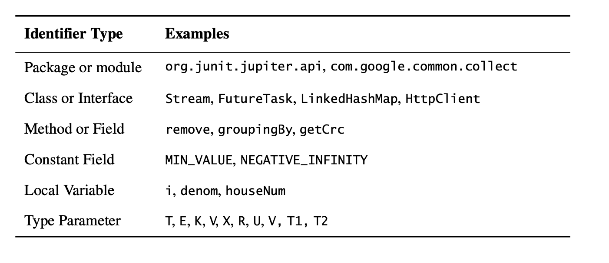

# Chapter 9: General Programming

## Item 57: Minimize the scope of local variables
The preferred idiom for iterating over collection:
```java
for (Element e : elements) {
    ...// Do something with e
}
```

If you need access to the iterator, perhaps to call its ```remove``` method, the preferred idiom uses a traditional for loop in place of the for-each loop:

```java
for (Iterator<Element> i = elements.iterator(); i.hasNext(); ) {
    Element e = i.next();
    ...// Do something with e
}
```

You should use following idiom if the loop test involves a method invocation that is guaranteed to return the same result on each iteration.

```java
for(int i = 0, n = expensiveComputation(); i < n; i++) {
    ...// Do something with i
}
```

## Item 58: Prefer for-each loops to traditional for loops

Unfortunately, there are three common situations where you can’ t use for-each:
- **Destructive filtering**—If you need to traverse a collection removing selected elements, then you need to use an explicit iterator so that you can call its remove method. Y ou can often avoid explicit traversal by using Collection’s removeIf method, added in Java 8.
- **Transforming**—If you need to traverse a list or array and replace some or all of the values of its elements, then you need the list iterator or array index in order to replace the value of an element.
- **Parallel iteration**—If you need to traverse multiple collections in parallel, then you need explicit control over the iterator or index variable so that all it- erators or index variables can be advanced in lockstep (as demonstrated unin- tentionally in the buggy card and dice examples above).

## Item 59: Know and use the libraries

## Item 60: Avoid float and double if exact answers are required
The ```float``` and ```double``` types are particularly ill-suited for monetary calculations because it is impossible to represent 0.1 as a ```float``` or ```double``` exactly.

```java
package effectivejava.chapter9.item60;

import java.math.BigDecimal;

public class BigDecimalChange {
    public static void main(String[] args) {
        final BigDecimal TEN_CENTS = new BigDecimal(".10");

        int itemsBought = 0;
        BigDecimal funds = new BigDecimal("1.00");
        for (BigDecimal price = TEN_CENTS;
             funds.compareTo(price) >= 0;
             price = price.add(TEN_CENTS)) {
            funds = funds.subtract(price);
            itemsBought++;
        }
        System.out.println(itemsBought + " items bought.");
        System.out.println("Money left over: $" + funds);
    }
}
```

```java
package effectivejava.chapter9.item60;

public class IntChange {
    public static void main(String[] args) {
        int itemsBought = 0;
        int funds = 100;
        for (int price = 10; funds >= price; price += 10) {
            funds -= price;
            itemsBought++;
        }
        System.out.println(itemsBought + " items bought.");
        System.out.println("Cash left over: " + funds + " cents");
    }
}
```

If the quantities don’t exceed nine decimal digits, you can use ```int```; if they don’t exceed eighteen digits, you can use ```long```. If the quantities might exceed eighteen digits, use ```BigDecimal```.

## Item 61: Prefer primitive types to boxed primitives

Applying the == operator to boxed primitives is almost always wrong since if i and j refer to distinct ```Integer``` instances that represent the same ```int``` value, this comparison will return ```false``` and the comparator will incorrectly return 1, indicating that the first ```Integer``` is greater than the second.

```java
package effectivejava.chapter9.item61;
import java.util.*;

// Broken comparator - can you spot the flaw? - Page 273
public class BrokenComparator {
    public static void main(String[] args) {

//        Comparator<Integer> naturalOrder =
//                (i, j) -> (i < j) ? -1 : (i == j ? 0 : 1);

       // Fixed Comparator - Page 274
        Comparator<Integer> naturalOrder = (iBoxed, jBoxed) -> {
            int i = iBoxed, j = jBoxed; // Auto-unboxing
            return i < j ? -1 : (i == j ? 0 : 1);
        };

        int result = naturalOrder.compare(new Integer(42), new Integer(42));
        System.out.println(result);
    }
}
```
```java
package effectivejava.chapter9.item61;

// What does this program do? - Page 274
public class Unbelievable {
    static Integer i;

    public static void main(String[] args) {
        if (i == 42)
            System.out.println("Unbelievable");
    }
}
```
It throws a ```NullPointerException``` when evaluating the expression ```i == 42``` since ```i``` is an ```Integer``` with initial value ```null```.

## Item 62: Avoid strings where other types are more appropriate
Strings are poor substitutes for capabilities (unforgeable key).

```java
// Broken - inappropriate use of string as capability! - Page 277
public class ThreadLocal {
    private ThreadLocal() { } // Noninstantiable

    // Sets the current thread's value for the named variable.
    public static void set(String key, Object value);

    // Returns the current thread's value for the named variable.
    public static Object get(String key);
}
```
```java
public class ThreadLocal {
    private ThreadLocal() { } // Noninstantiable

    public static class Key { // (Capability)
        Key() { }
    }

    // Generates a unique, unforgeable key
    public static Key getKey() {
        return new Key();
    }
    
    public static void set(Key key, Object value);
    public static Object get(Key key);
```

## Item 63: Beware the performance of string concatenation
Use ```StringBuilder``` instead of ```String``` to concatenate strings.

```java
public String statement() {
    StringBuilder b = new StringBuilder(numItems() * LINE_WIDTH);
    for (int i = 0; i < numItems(); i++)
        b.append(lineForItem(i));
    return b.toString();
}
```

## Item 64: Refer to objects by their interfaces
If you get into the habit of using interfaces as types, your program will be much more flexible. If you decide that you want to switch implementations, all you have to do is change the class name in the constructor (or use a different static factory).

```java
// Good - uses interface as type - Page 280
Set<Son> sonSet = new HashSet<>();
```
```java
// Bad - uses class as type! - Page 280
HashSet<Son> sonSet = new HashSet<>();
```

## Item 65: Prefer interfaces to reflection
The core reflection facility, ```java.lang.reflect```, offers programmatic access to arbitrary classes. Given a ```Class``` object, you can obtain ```Constructor```, ```Method```, and ```Field``` instances representing the constructors, methods, and fields of the class represented by the ```Class``` instance. These objects provide programmatic access to the class’s member names, field types, method signatures, and so on.

Reflection allows one class to use another, even if the latter class did not exist when the former was compiled. But you lose all the benefitss of compile-time type checking and performance suffers.

```java
package effectivejava.chapter9.item65;

import java.lang.reflect.Constructor;
import java.lang.reflect.InvocationTargetException;
import java.util.Arrays;
import java.util.Set;

// Reflective instantiaion demo (Page 283)
public class ReflectiveInstantiation {
    // Reflective instantiation with interface access
    public static void main(String[] args) {
        // Translate the class name into a Class object
        Class<? extends Set<String>> cl = null;
        try {
            cl = (Class<? extends Set<String>>)  // Unchecked cast!
                    Class.forName(args[0]);
        } catch (ClassNotFoundException e) {
            fatalError("Class not found.");
        }

        // Get the constructor
        Constructor<? extends Set<String>> cons = null;
        try {
            cons = cl.getDeclaredConstructor();
        } catch (NoSuchMethodException e) {
            fatalError("No parameterless constructor");
        }

        // Instantiate the set
        Set<String> s = null;
        try {
            s = cons.newInstance();
        } catch (IllegalAccessException e) {
            fatalError("Constructor not accessible");
        } catch (InstantiationException e) {
            fatalError("Class not instantiable.");
        } catch (InvocationTargetException e) {
            fatalError("Constructor threw " + e.getCause());
        } catch (ClassCastException e) {
            fatalError("Class doesn't implement Set");
        }

        // Exercise the set
        s.addAll(Arrays.asList(args).subList(1, args.length));
        System.out.println(s);
    }

    private static void fatalError(String msg) {
        System.err.println(msg);
        System.exit(1);
    }
}
```

Code analysis tools and dependency injection frameworks often require reflection.

## Item 66: Use native methods judiciously
The Java Native Interface (JNI) allows Java programs to call native methods, which are methods written in native programming languages such as C or C++.

The use of native methods has serious disadvantages. Because native languages are not safe and more platform-dependent and harder to debug. Native methods can decrease performance because the garbage collector can't automate, or even track, native memory usage.

## Item 67: Optimize judiciously
- Profiling toolss can help you decide where to focus your optimization efforts.
- Another tool that deserves special mention is jmh, which is not a profiler but a microbenchmarking framework that provides unparalleled visibility into the detailed performance of Java code.

## Item 68: Adhere to generally accepted naming conventions
Type parameter names usually consist of a single letter. Most commonly it is one of these five: ```T``` for an arbitrary type, ```E``` for the element type of a collection, ```K``` and ```V``` for the key and value types of a map, and ```X``` for an exception. The return type of a function is usually ```R```. A sequence of arbitrary types can be ```T, U, V or T1, T2, T3```.



A few method names deserve special mention. Instance methods that convert the type of an object, returning an independent object of a different type, are often called ```toType```, for example, ```toString``` or ```toArray```. Methods that return a view (Item 6) whose type differs from that of the receiving object are often called ```asType```, for example, ```asList```. Methods that return a primitive with the same value as the object on which they’re invoked are often called ```typeValue```, for example, ```intValue```. Common names for static factories include ```from, of, valueOf, instance, getInstance, newInstance, getType, and newType``` (Item 1, page 9).